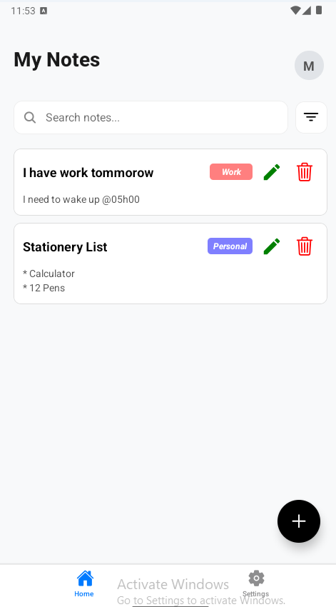
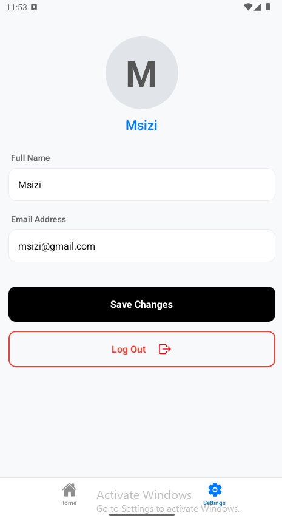

# NotesApp


A robust React Native application built with **Expo**. This app allows users to capture their thoughts through text notes.

#### Key Features

- **User Authentication**: Secure Login and Registration flow for personalized data management.
- **Audio Recording**: High-fidelity voice notes with real-time playback and duration tracking.
- **Note Management**: Full CRUD capabilities for text and audio-based notes.
- **Profile Customization**: Personal settings to manage user details and initials-based avatars.
- **Persistent Storage**: Local data persistence ensuring your notes are safe between sessions.

#### Get Started

1. **Install dependencies**

```bash
npm install
```

2. Start running the expo app with

```bash
npm start
```

#### Project Structure

```bash
NotesApp
├── app/                  # Expo Router (File-based Navigation)
│   ├── auth/             # Authentication Screens
│   │   ├── _layout.tsx   # Auth group layout
│   │   ├── login.tsx     # User Login
│   │   └── register.tsx  # Account Registration
│   ├── notes/            # Main Application Features
│   │   ├── _layout.tsx   # Notes group layout
│   │   ├── index.tsx     # Notes Dashboard (List View)
│   │   └── settings.tsx  # User Profile & App Settings
│   └── _layout.tsx       # Root layout and global providers
├── components/           # Reusable UI Components
│   └── NoteCard.tsx      # Individual Card for Text/Audio Notes
├── hooks/                # Custom React Hooks for logic reuse
├── types/                # TypeScript Definitions
│   ├── Note.ts           # Interface for Note objects
│   └── User.ts           # Interface for User profile data
├── utils/                # Helper Functions
│   └── storage.ts        # LocalStorage/AsyncStorage abstractions
├── assets/               # Static Media (Icons, Splash, Audio)
├── app.json              # Expo Configuration
└── tsconfig.json         # TypeScript Compiler Settings
```

#### Technologies Used

- Framework: React Native with Expo

- Navigation: Expo Router

- Language: TypeScript

- Icons: Expo Vector Icons (Ionicons)

- Audio: Expo-AV for recording and playback

#### Screenshots

<p align="center">
  
  
  
</p>

#### Author

M.S Mwelase
